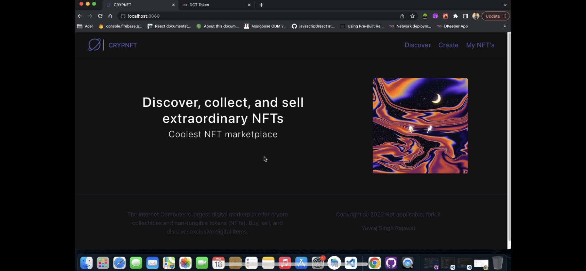
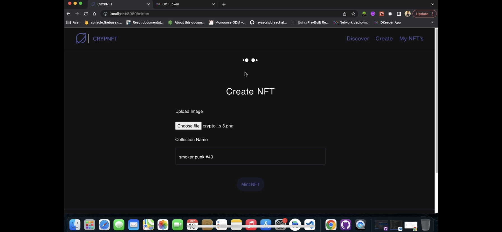
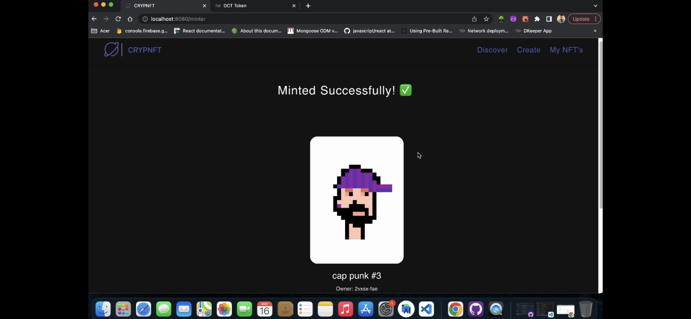
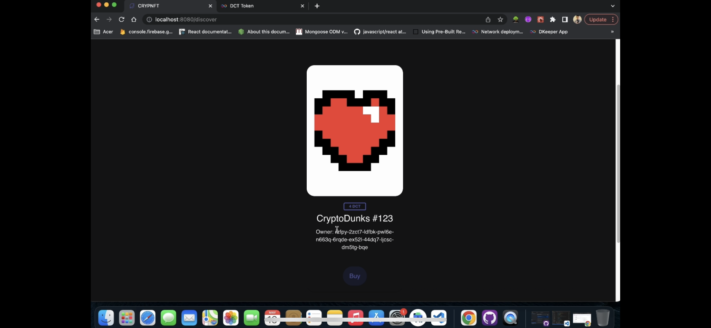
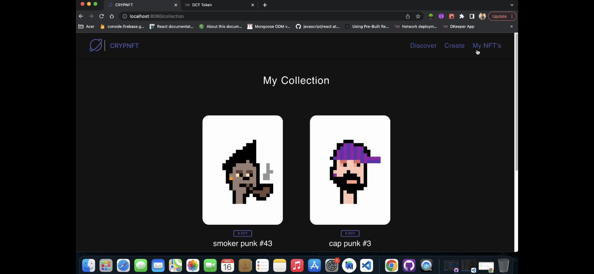
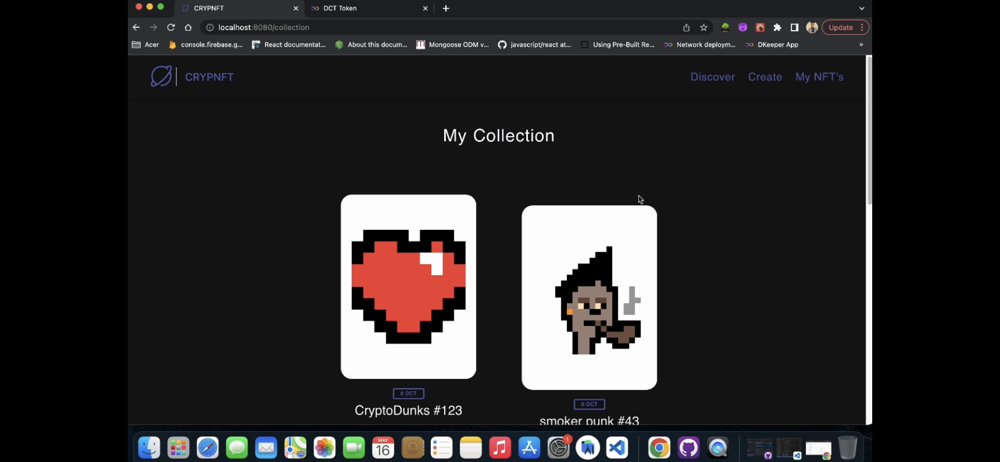
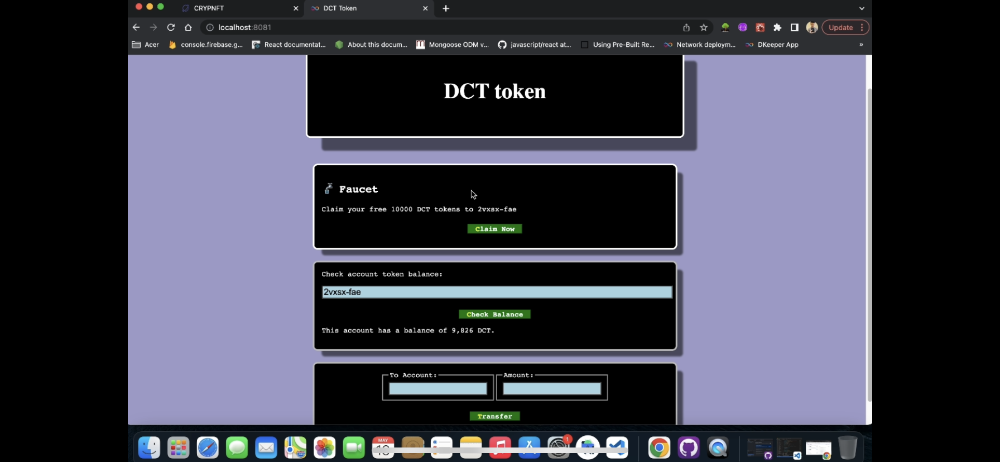
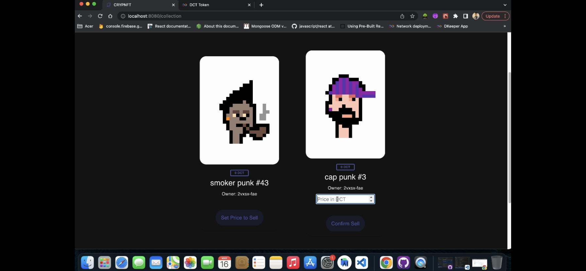
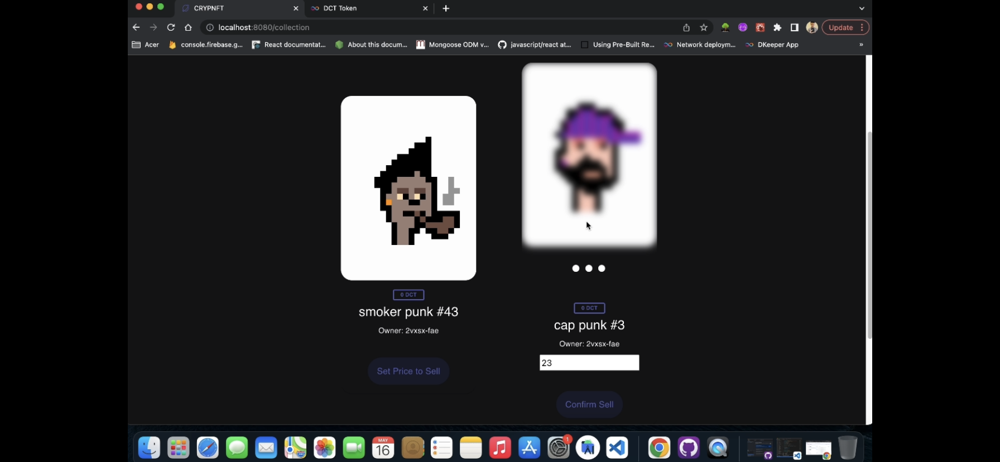

# CRYPNFT

Created a decentralised crypto token ”DCT” from scratch on ICP blockchain
network using back-end logic in Motoko smart contracts. Developed a NFT marketplace using React and Motoko where users can
discover NFT collections, buy from it , mint NFTs and list their NFT’s for sell. Integrated the DCT token wallet as payment method for the transcations.

# Demo

Please follow the link below about section or follow link below

<a href="https://bit.ly/3laycJr">Click here for Demo</a>

# Features

1. User can claim their free DCT token from the DCT Faucet.
2. User links this DCT Wallet to the crypNFT marketplace and all the transcations are completed from the same wallet.
3. On the Discover page user can find NFT's minted by other users listed on listing HashMap with their price and owner id.
4. User can buy NFT's from discover page and the ownership is transfered to user and amount is deducted from user's DCT wallet and deposited to seller.
5. User can find out owned and self minted NFT's in My-NFT section of the application.
6. User can list his/her NFT's for sale and once listed they are shown in discover section and image in blurred with status listed on My-NFT page.
7. User listed NFT's are owned by the CRYPNFT platform and User can't buy his/her own listed NFT's.
8. User can mint new NFT using experimental cycles and minted NFT's are added to the My-NFT section.
9. In order to mint NFT's as 3rd party we can use command line function calls using dfx.

# Tech

1. Frontend: HTML, CSS, ES6, JavaScript, react, react-router, react-hooks
2. Backend: Motoko smart contracts and internet computer

# Screenshots

1. DCT Token Wallet


2. Homepage



3. Minting NFT





4. Discover 



5. My collection



6. Bought NFT from discover transfered to my collection



7. Wallet balance down by 4 DCT for buying NFT



8. Setting price for sale



9. Sale confirmed




# To Install and Run the Project

1. start local dfx

```
dfx start --clean
```

2. Run NPM server

```
npm start
```

3. Deploy canisters

```
dfx deploy --argument='("Crypto heart #123", principal "<Your_prinipal_ID>", (vec {137; 80; 78; 71; 13; 10; 26; 10; 0; 0; 0; 13; 73; 72; 68; 82; 0; 0; 0; 10; 0; 0; 0; 10; 8; 6; 0; 0; 0; 141; 50; 207; 189; 0; 0; 0; 1; 115; 82; 71; 66; 0; 174; 206; 28; 233; 0; 0; 0; 68; 101; 88; 73; 102; 77; 77; 0; 42; 0; 0; 0; 8; 0; 1; 135; 105; 0; 4; 0; 0; 0; 1; 0; 0; 0; 26; 0; 0; 0; 0; 0; 3; 160; 1; 0; 3; 0; 0; 0; 1; 0; 1; 0; 0; 160; 2; 0; 4; 0; 0; 0; 1; 0; 0; 0; 10; 160; 3; 0; 4; 0; 0; 0; 1; 0; 0; 0; 10; 0; 0; 0; 0; 59; 120; 184; 245; 0; 0; 0; 113; 73; 68; 65; 84; 24; 25; 133; 143; 203; 13; 128; 48; 12; 67; 147; 94; 97; 30; 24; 0; 198; 134; 1; 96; 30; 56; 151; 56; 212; 85; 68; 17; 88; 106; 243; 241; 235; 39; 42; 183; 114; 137; 12; 106; 73; 236; 105; 98; 227; 152; 6; 193; 42; 114; 40; 214; 126; 50; 52; 8; 74; 183; 108; 158; 159; 243; 40; 253; 186; 75; 122; 131; 64; 0; 160; 192; 168; 109; 241; 47; 244; 154; 152; 112; 237; 159; 252; 105; 64; 95; 48; 61; 12; 3; 61; 167; 244; 38; 33; 43; 148; 96; 3; 71; 8; 102; 4; 43; 140; 164; 168; 250; 23; 219; 242; 38; 84; 91; 18; 112; 63; 0; 0; 0; 0; 73; 69; 78; 68; 174; 66; 96; 130;}))'
```

4. Head to localhost

http://localhost:8080/


# Creating NFT for Testing

1. Mint an NFT on the command line to get NFT into mapOfNFTs:

```
dfx canister call opend mint '(vec {137; 80; 78; 71; 13; 10; 26; 10; 0; 0; 0; 13; 73; 72; 68; 82; 0; 0; 0; 10; 0; 0; 0; 10; 8; 6; 0; 0; 0; 141; 50; 207; 189; 0; 0; 0; 1; 115; 82; 71; 66; 0; 174; 206; 28; 233; 0; 0; 0; 68; 101; 88; 73; 102; 77; 77; 0; 42; 0; 0; 0; 8; 0; 1; 135; 105; 0; 4; 0; 0; 0; 1; 0; 0; 0; 26; 0; 0; 0; 0; 0; 3; 160; 1; 0; 3; 0; 0; 0; 1; 0; 1; 0; 0; 160; 2; 0; 4; 0; 0; 0; 1; 0; 0; 0; 10; 160; 3; 0; 4; 0; 0; 0; 1; 0; 0; 0; 10; 0; 0; 0; 0; 59; 120; 184; 245; 0; 0; 0; 113; 73; 68; 65; 84; 24; 25; 133; 143; 203; 13; 128; 48; 12; 67; 147; 94; 97; 30; 24; 0; 198; 134; 1; 96; 30; 56; 151; 56; 212; 85; 68; 17; 88; 106; 243; 241; 235; 39; 42; 183; 114; 137; 12; 106; 73; 236; 105; 98; 227; 152; 6; 193; 42; 114; 40; 214; 126; 50; 52; 8; 74; 183; 108; 158; 159; 243; 40; 253; 186; 75; 122; 131; 64; 0; 160; 192; 168; 109; 241; 47; 244; 154; 152; 112; 237; 159; 252; 105; 64; 95; 48; 61; 12; 3; 61; 167; 244; 38; 33; 43; 148; 96; 3; 71; 8; 102; 4; 43; 140; 164; 168; 250; 23; 219; 242; 38; 84; 91; 18; 112; 63; 0; 0; 0; 0; 73; 69; 78; 68; 174; 66; 96; 130;}, "Cryptoheart #12")'
```
RETURNS PRINCIPAL ID OF NFT

2. List the item into mapOfListings:

```
dfx canister call opend listItem '(principal "<NFT_CANISTER_PRINCIPAL_ID>", 2)'
```

3. Get OpenD canister ID:

```
dfx canister id opend
```

4. Transfer NFT to OpenD:

```
dfx canister call <NFT_CANISTER_PRINCIPAL_ID> transferOwnership '(principal "<YOUR_PRINCIPAL_ID>", true)'
```

# Conneting to the Token Canister

1. Copy over the token declarations folder

2. Set the token canister id into the <REPLACE WITH TOKEN CANISTER ID>

```
const dangPrincipal = Principal.fromText("<REPLACE WITH TOKEN CANISTER ID>");
```
# To make calls to DCT token wallet

 1. Update node modules
  
  ```
  npm install
  ```
  
 2. Deploy on local network
  
  ```
  dfx deploy
  ```
 3. Start frontend
 
 ```
 npm start
 ```
 
 4. Head to LocalHost 8081
 
 http://localhost:8081/
  
